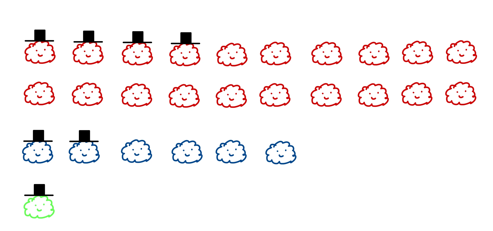
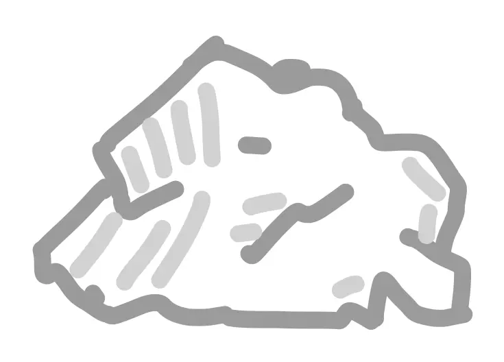
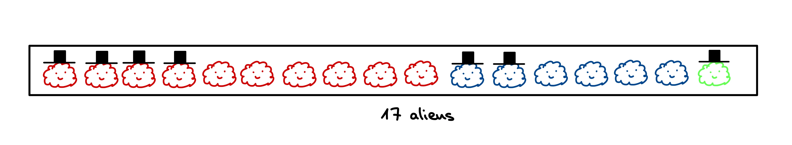
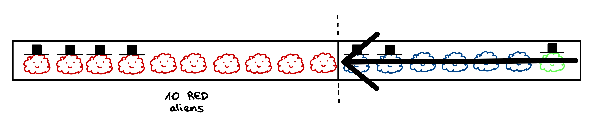
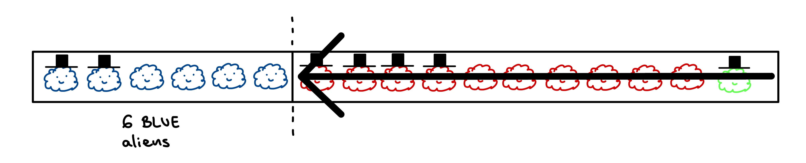
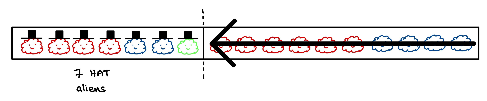
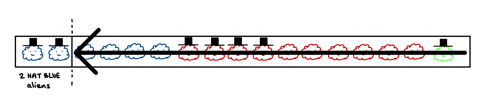
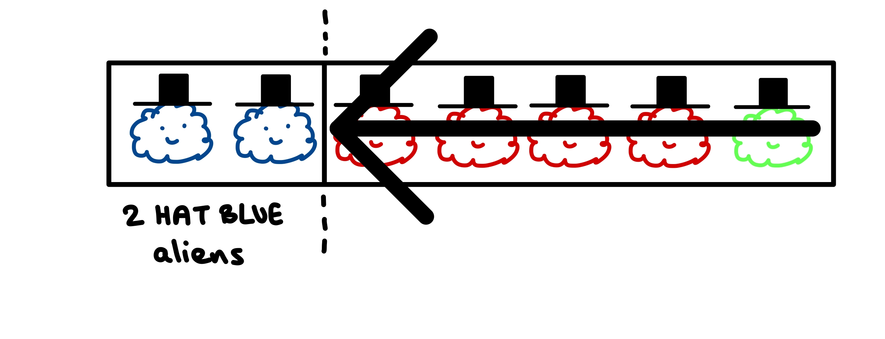
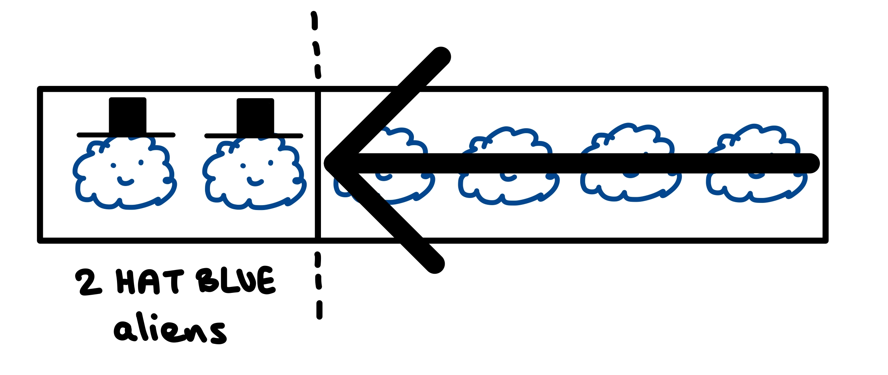

---
title:
draft: false
tags:
---
$$\large
P(H \mid E) = \frac{P(H \wedge E)}{P(E)}
$$

The *Bayes Theorem* tells us how to update our believe about a certain hypothesis (H) being true, given that we have observed some evidence (E).

$\large H$ and $\large E$ are [[random variable]]s, either discrete or continuous. So, in simple words, we are often asking "*What is the probability of $\large H = h_i$ given that we know $\large E = e_j$?*"

| **Component** | **Technical Name**    | **Mathematical Meaning**                               |
| ------------- | --------------------- | ------------------------------------------------------ |
| $P(H \mid E)$ | Posterior Probability | The probability of hypothesis $H$ given evidence $E$.  |
| $P(H)$        | Prior Probability     | The initial probability of $A$ before seeing evidence. |
| $P(E \mid H)$ | Likelihood            | The probability of the evidence $E$ given $H$ is true. |
| $P(B)$        | Marginal Likelihood   | The total probability of the evidence $B$ occurring.   |

Let's build some intuition about the formula, from simpler problems to more complex (and perhaps more real) scenarios.
## Intuition

#### Stylish Aliens
Say you travel to a distant planet filled with friendly aliens of different colors. They all get along well, but don't seem to agree on wether wearing hats is stylish or not.

  

These aliens like to play a game. One alien, we don't know which, will hide behind a rock its size, letting us only see wether the alien is wearing a hat or not. But we can not see the alien itself. 

Alien with a hat behind a rock:

  

Alien without a hat behind a rock:

  

Then, the alien will ask us "*Which color do you think I am?*".

If the alien were to be hiding behind a tree, giving us no information, then our best bet would just be to guess the most abundant color in the plant. But we do have some valuable information about the alien hiding behind the rock, and we should use it to our advantage.

###### Evidence vs Hypothesis

In the game, the evidence $\large E$ will be either $\large E =$ *hat* if we can see a hat, or $\large E =$ *no hat* otherwise, as it is what we can see. Let's simplify the terminology by saying the probability of the alien which decided to hide is wearing a hat or not is $\large P(H)$ and $\large P(\neg H)$ respectively. It is important to keep in mind that in non binary outcomes, we often don't simplify the terminology like this as there may be many states.

Our hypothesis $\large H$ will be asking ourselves what is the color of the alien hiding, wether $\large H =$ *red*, $\large H =$ *blue* or $\large H =$ *green*. Similarly as before, we will use $\large P(R)$, $\large P(B)$ and $\large P(G)$ respectively.

###### P(H), P(E), P(H ^ E)
We can start trying to describe our alien population, which will help us answer the question of the game. I like to imagine that I have all the elements of my problem within a rectangle, one after the other.

  

I use this to visualize better different questions we may ask ourselves. 

Often, we are not interested on just knowing the total number of red aliens. What we care about, is to know if there are a lot of red aliens with respect to the total population or not. Same with the other colors, or aliens wearing a hat, or aliens of a specific color that also wear a hat, and so on. In all these cases, we **count the number of aliens of interest to us, and divide it by the total amount of aliens**.

Let's see some examples:

$\large P(H=red) = \frac{\# reds}{\# \text{total aliens}} = \frac{10}{17} \approx 0.6$

This is saying, how big is the proportion of reds over the whole population? To visualize it better, I like to imagine telling the aliens: "*All of you who are red, stand at the beginning of the line*". And then, compressing the rectangle to eliminate anything that is not red. $\large P(H=red)$ is indicating how much we need to compress the original rectangle to arrive to the reduced one:

  

Visualizing P() as a *squeeze* operation over some original length or count, helps us understand better that if we know the total number of aliens, and the proportion of them which are red, we can do:

$\large \# reds = \# \text{total aliens} \cdot \underbrace{P(H=red)}_{squeeze} = 17 \cdot 0.6 \approx 10$

We can do the same for other elements.

See that if we order the blues on the left, we would need to compress the rectangle more, so the resulting one will be smaller with respect to the original.

  

$\large P(B) = \frac{\# blues}{\# aliens} = \frac{6}{17} \approx 0.35$

Not only colors, but we can do the same for $\large P(E=hat)$. "*All of you who have a hat, stand at the beginning of the line*":

  

$\large P(H) = \frac{\# hat}{\# aliens} = \frac{7}{17} \approx 0.4$

For computing negations, such as $\large P(E = \neg hat)$ and so on, just do the same. "*All of you who don't have a hat, stand at the beginning of the line*". But if you notice, when we saw $\large P(E= hat)$ in the previous drawing, we can already visualize how long is the rectangle of those which don't have a hat. Summing the length of those with hat, and those with no hat, gives us the whole original length. Thus $\large P(E = hat) + P(E = \neg hat) = 1$. Often, we commonly see $\large P(E = hat) = 1 - P(E = \neg hat)$ or $\large P(E = \neg hat) = 1 - P(E = hat)$ , which is equivalent.

We can even combine characteristics. How big in proportion with respect to the whole population, are aliens which are blue AND also are wearing a hat. "*All of you who are blue AND also have a hat, stand at the beginning of the line*".

  

$\large P(B \wedge H) = \frac{\# \text{blue AND hat}}{\# aliens} = \frac{2}{17} \approx 0.1$

Up until now, notice that to compute $\large P(X)$, whatever $\large X$ happens to be, we just count the number of occurrences of $\large X$ and divided by the total count of elements in our environment. Our original rectangle was always the total one.

But in our original game, we don't really care about the whole population. We KNOW already if the alien hiding has a hat or not.

###### P(H | E)

What is the probability of say, $\large P(H=blue \mid E=hat)$?

The evidence says we now only have aliens with hats to consider. How big is the proportion of blue ones *in that group*?

  

<small>Image 9: P(H=blue | E=hat)</small>

The idea is the same. Either find the count or the length of aliens which are blue and have a hat, and divide it by the count or the length of all aliens with a hat. Notice, that now we don't divide by the total length of the original rectangle. Our new base rectangle has been bounded.

Using counts we would have:

$\large P(H=blue \mid E=hat) = \frac{\# \text{blue AND hat}}{\# hat}$

And imagining the lengths of the compressed rectangles we would have:

$\large P(H=blue \mid E=hat) = \frac{P(B \wedge H)}{P(E=hat)}$

Both are equivalent, and can be derived by the simple trick we saw of:

$\large \# reds = \# \text{total aliens} \cdot \underbrace{P(H=red)}_{squeeze}$

Take a look again at the image of when we computed $\large P(B \wedge H)$. Can you imagine another way of arriving to the same rectangle (which contains two hat blue aliens), using a combination of other compressions?

Rather than saying directly, "*All of you who are blue AND also have a hat, stand at the beginning of the line*", which is $\large P(B \wedge H)$, we could instead say:

"*All of you who are blue, stand at the beginning of the line*" (recall this is $\large P(H=blue)$).

  

To the resulting group, we could tell them: 
"*All of you who have a hat (given that you are blue), stand at the beginning of the line*"

  

Oddly similar to the Image 9 isn't it. We are also taking the proportion of some elements of a rectangle which is bounded compared with the total original one. Well, this is because this action is represented by the same formula type, $\large P(E=hat \mid H=blue)$.

If we combine both instructions, we are doing $\large P(H=blue) \cdot P(E=hat \mid H=blue)$ to the original rectangle.

Thus, we have arrived to the most common way of seen the Bayes Theorem:

$\large P(H=blue \mid E=hat) = \frac{P(B \wedge H)}{P(E=hat)} = \frac{P(E=hat \mid H=blue)}{P(E=hat)}$

Now, to answer the question of the game, we should look at the group of aliens with hat, and just say whichever color is more dominant within that group (we can see fast that this is red). Mathematically, this is equivalent of choosing:

$\large max(P(H=red \mid E=hat), P(H=blue \mid E=hat), P(H=green \mid E=hat))$

## Takeaways

Why do we often hear that *Bayes' Theorem* is updating our believes?

Because without evidence, our knowledge of P(H) is as good as we have. That is, we only can tell which color is more likely a priori. 
But as soon as we get some information (evidence), we can update our believe about how probable each of the hypothesis actually is. That is, we can tell which color is more likely within the evidence group.

When we look at the aliens, and see that the wearing hat is so popular for greens (100% actually), if we get asked the question, "There's an alien with a hat behind the rock, which color do you think it is?", we sometimes think "Hats are so popular for greens. Most likely it'll be a green". But we often forget to take into account, how likely it is for an alien to be green to begin with. That is, we often forget about the *prior*.
